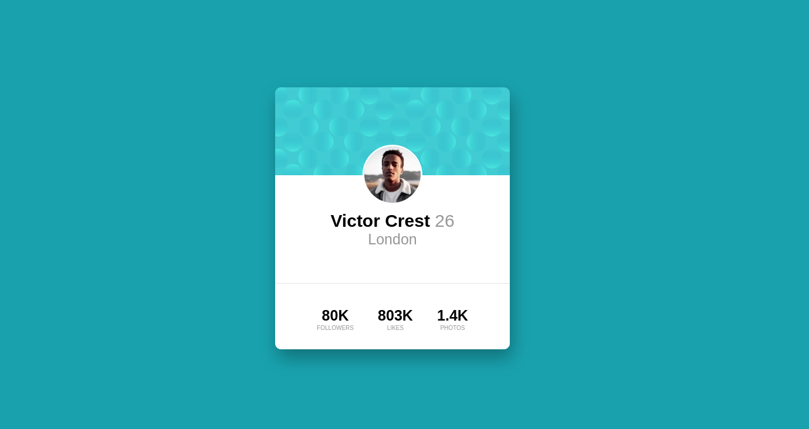

# Frontend Mentor - Profile card component solution

This is a solution to the [Profile card component challenge on Frontend Mentor](https://www.frontendmentor.io/challenges/profile-card-component-cfArpWshJ). Frontend Mentor challenges help you improve your coding skills by building realistic projects. 

## Table of contents

- [Overview](#overview)
  - [The challenge](#the-challenge)
  - [Screenshot](#screenshot)
  - [Links](#links)
- [My process](#my-process)
  - [Built with](#built-with)
  - [What I learned](#what-i-learned)
  - [Continued development](#continued-development)
  - [Useful resources](#useful-resources)
- [Author](#author)


## Overview

### The challenge

- Build out the project to the designs provided

### Screenshot




### Links

- Solution URL: [https://github.com/waltersono/frontendmentor-profile-card](https://github.com/waltersono/frontendmentor-profile-card)
- Live Site URL: [https://waltersono.github.io/frontendmentor-profile-card/](https://waltersono.github.io/frontendmentor-profile-card/)

## My process

### Built with

- Semantic HTML5 markup
- CSS custom properties
- Flexbox

### What I learned
I learn how to add two background images and rotate each individual one:

```html
<h1>Here is the code:</h1>
```
```css
.container::before {
    content: "";
    position: absolute;
    top: -70rem;
    left: -90rem;
    width: 100%;
    height: 100%;
    background-image: url("images/bg-pattern-top.svg");
    background-size: auto;
    z-index: 1;
    transform: rotate(70deg);
}

.container::after {
    content: "";
    position: absolute;
    bottom: -110rem;
    right: -70rem;
    width: 100%;
    height: 100%;
    background-image: url("images/bg-pattern-bottom.svg");
    background-size: auto;
    z-index: 1;
    transform: rotate(45deg);
}
```

### Continued development

I will continue exploring background images and the pseudo-elements.


### Useful resources

- [How to rotate background image](https://stackoverflow.com/questions/5087420/how-to-rotate-the-background-image-in-the-container) - This helped me understand how to rotate a background image.


## Author

- Github - [Walter Sono](https://www.github.com/waltersono)
- Frontend Mentor - [@waltersono](https://www.frontendmentor.io/profile/waltersono)
- Linkedin - [@waltersono](https://www.linkedin.com/in/waltersono/)
